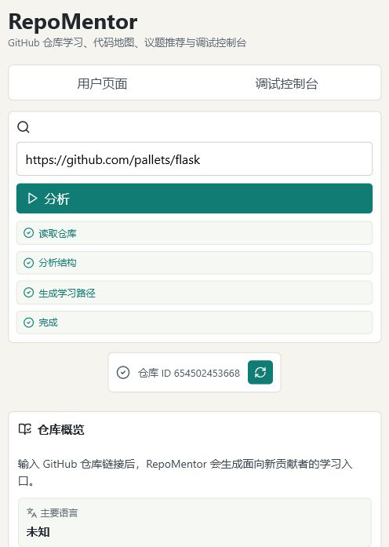
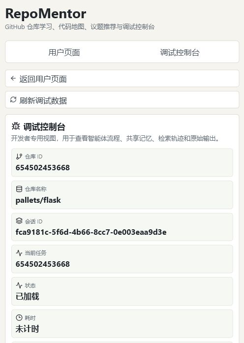

# RepoMentor：多智能体仓库学习助手

> 输入一个公开 GitHub 仓库链接，生成仓库概览、代码地图、学习路径、开发流程、推荐任务和证据约束问答，帮助新贡献者更快理解陌生项目。

[](#前端启动)
[](#后端启动)
[](#模型模式)
[](LICENSE)

RepoMentor 的目标不是做一个普通聊天框，而是先恢复仓库结构，再基于证据生成可验证的学习建议。

## 核心能力

- 仓库智能图谱：解析文件、符号、导入关系、测试关系、文档关系和质量命令。
- 学习路径 V2：按“目标、操作、观察、自检”组织学习任务。
- 开发流程识别：提取安装、启动、测试、评估、PR/CI 和风险提示。
- 推荐任务：优先使用真实 open issue；没有 open issue 时生成 internal first tasks。
- 证据约束问答：回答必须能追溯到 README、代码、测试、Issue 或 Repository Graph。
- 调试控制台：展示 Agent Flow、Worker 输出、Data Layer、Shared Memory、SelfCheck 和 FinalAnswer JSON。

## 页面预览

| 用户页 | 调试页 |
| --- | --- |
|  |  |

用户页面向新贡献者，只展示学习和贡献所需信息。调试页面向开发者和评审，用来验证系统确实执行了多 Worker 分析、证据检索和自检流程。

## 本地运行

当前公开仓库只保留本地开发运行方式，暂不提供公网访问地址、容器化一键运行文件或录屏脚本。

### 后端启动

```powershell
cd backend
python -m venv .venv
.\.venv\Scripts\activate
pip install -r requirements.txt
copy .env.example .env
uvicorn app.main:app --reload --port 8000
```

后端健康检查：

```text
http://127.0.0.1:8000/api/health
```

### 前端启动

```powershell
cd frontend
npm install
npm run dev
```

本地访问：

```text
http://127.0.0.1:5173
```

前端默认读取：

```env
VITE_API_BASE_URL=http://127.0.0.1:8000
```

## 使用流程

1. 打开 `http://127.0.0.1:5173`。
2. 输入公开 GitHub 仓库链接。
3. 点击分析仓库。
4. 在用户页查看仓库概览、代码地图、学习路径、开发流程和推荐任务。
5. 在问答区提问，例如：`这个项目怎么启动？`
6. 如需验证内部执行轨迹，进入 `/debug/{repo_id}` 查看调试控制台。

## 模型模式

RepoMentor 的仓库事实来自确定性解析和 Repository Intelligence Graph，模型只负责解释、组织和润色已检索到的证据。

默认可配置 DeepSeek：

```env
LLM_PROVIDER=deepseek
DEEPSEEK_MODEL=deepseek-chat
DEEPSEEK_BASE_URL=https://api.deepseek.com
DEEPSEEK_API_KEY=your_key_here
```

如果没有配置 `DEEPSEEK_API_KEY`，后端会回退到 Mock Provider，不会崩溃，也不会产生模型费用。

安全要求：

- 不要提交 `.env` 或 `backend/.env`。
- 不要把 API Key 写入代码、README、截图或前端默认值。
- 如果 Key 泄露，请立即在模型平台撤销并重新生成。

## 系统架构

RepoMentor 分为五层：

1. 前端层：用户页和调试控制台。
2. 后端 API 层：FastAPI、REST API、Debug API。
3. Agent 层：Orchestrator、多 Worker、Evaluator、Optimizer。
4. 数据层：Repository Intelligence Graph、Hybrid Retrieval Index、Shared Working Memory、Evidence Store。
5. 外部服务：GitHub API、DeepSeek 或 Mock Provider。

Worker 之间不进行开放式群聊。`Orchestrator` 统一调度 Worker，把输出写入 `SharedWorkingMemory`，再进行证据检索、答案生成、自检和修正。

## 设计依据

RepoMentor 的模块设计明确区分“设计依据”和“数据证据”：

- 设计依据：解释为什么模块这样设计，例如任务化学习路径、渐进式脚手架、Repository Intelligence Graph、EvidenceBuilder、SelfCheck。
- 数据证据：解释本次输出来自哪里，例如 README、入口文件、测试文件、质量命令、Issue、文档切片。

详细说明见：

- `docs/design_basis.md`
- `presentation/design_basis.md`

## 前端页面

- 用户页：`/` 或 `/repos/{repo_id}`，面向新贡献者，展示仓库概览、代码地图、学习路径、开发流程、推荐任务、仓库问答和简化证据。
- 调试页：`/debug/{repo_id}` 或 `/debug/session/{session_id}`，面向开发者和评审，展示 Agent Flow、Worker Outputs、Data Layer、Retrieval Trace、Shared Memory、SelfCheck、FinalAnswer JSON 和模型状态。

用户页不会展示原始 Worker JSON、共享记忆、检索轨迹、Evaluator 原始输出或 FinalAnswer 原始 JSON。这些信息只保留在调试页。

## 常用 API

分析仓库：

```powershell
curl -X POST http://127.0.0.1:8000/api/repos/analyze `
  -H "Content-Type: application/json" `
  -d "{\"repo_url\":\"https://github.com/pallets/flask\"}"
```

获取开发流程：

```powershell
curl http://127.0.0.1:8000/api/repos/{repo_id}/development-workflow
```

模型状态：

```powershell
curl http://127.0.0.1:8000/api/model/status
```

## 测试与验证

后端测试：

```powershell
cd backend
.\.venv\Scripts\python.exe -m pytest -q
```

前端构建：

```powershell
cd frontend
npm run build
```

Smoke test：

```powershell
python scripts/smoke_test.py
```

压力测试结论记录在 `docs/testing_summary.md`。早期压力测试失败的主要原因是 evidence coverage 不足，不是系统崩溃；后续路线优先补强 EvidenceBuilder、SelfCheck 和 DeepSeek 实测。

## 展示材料

当前仓库保留 PPT 和文档型展示材料：

- PPT：`presentation/RepoMentor_Final_Presentation.pptx`
- PDF：`presentation/RepoMentor_Final_Presentation.pdf`
- 讲稿：`presentation/speaker_notes.md`
- 展示提纲：`presentation/presentation_outline.md`
- 交互轨迹：`docs/interaction_trace.md`
- 测试总结：`docs/testing_summary.md`
- 升级计划：`docs/upgrade_plan.md`

不再保留公网访问占位地址、容器化发布文件、录屏脚本或提交地址模板。

## 项目范围

当前版本已经实现：

- Python AST 符号和导入解析。
- JS/TS 轻量级符号和导入解析。
- README、docs、测试文件和质量命令提取。
- Docs Worker、Test Worker、Development Workflow Worker 等 8 个 Worker。
- Issue 推荐与 internal first tasks fallback。
- Evidence-grounded QA、SelfCheck、FinalAnswer JSON。
- 用户页和调试页分离。
- Mock Provider 和 DeepSeek Provider 配置入口。

下一阶段重点：

- EvidenceBuilder 覆盖率提升。
- DeepSeek 小仓库真实效果评估。
- LangGraph 默认状态图编排。
- 多仓库评测和更稳定的贡献任务推荐。

## 开源说明

本项目使用 MIT License。欢迎用于课程项目、开源新人引导、仓库理解工具和 Agent 可观测性实验。如果这个项目对你有帮助，欢迎 star、fork 或基于 issue 提建议。

## 实验记录

每次实现变更都会保留实验记录。核心记录入口：

- `docs/experiment_records.md`
- `docs/interaction_trace.md`
