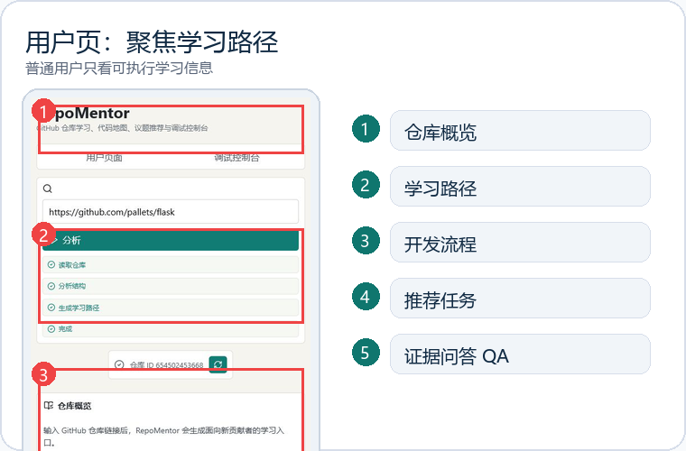
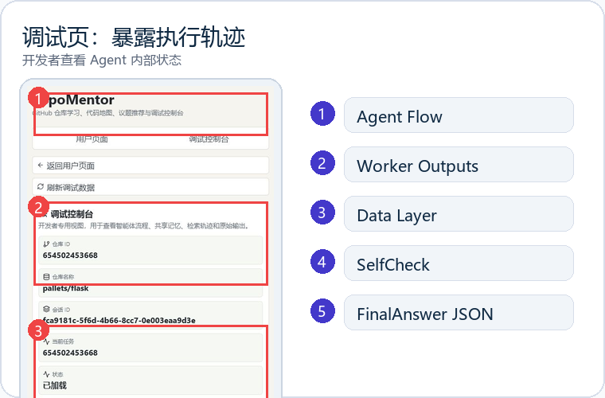

# RepoMentor

> Structure-aware GitHub repository learning agent for newcomers.
> 输入一个 GitHub 仓库链接，生成代码地图、学习路径、开发流程、入门任务和 evidence-grounded QA。

[](#run-frontend)
[](#run-backend)
[](#model-modes)
[](LICENSE)

RepoMentor helps new contributors move from “I do not know where to start” to a runnable learning path:

- Repository Intelligence Graph: files, symbols, imports, docs, tests, commands.
- Learning Path V2: goals, actions, observations, self-check questions.
- Contribution Funnel: real issues first, internal first tasks when no open issue exists.
- Evidence-grounded QA: answers trace back to docs, code, tests, issues, or graph evidence.
- Debug Console: Agent Flow, Worker Outputs, Data Layer, Shared Memory, SelfCheck, FinalAnswer JSON.

If this project is useful for your course, open-source onboarding, or agent evaluation work, a star helps others find it.

## Screenshots

| User Dashboard | Debug Console |
| --- | --- |
|  |  |

## Quick Start

### Docker One-Command Demo

```bash
docker compose up --build
```

Open:

```text
http://127.0.0.1:5173
```

`127.0.0.1` is local-only. For online demos, deploy the frontend to Vercel and backend to Render/Railway.

### Presentation Materials

- Final PPT: `presentation/RepoMentor_Final_Demo.pptx`
- PDF: `presentation/RepoMentor_Final_Demo.pdf`
- Speaker notes: `presentation/speaker_notes.md`
- Design basis: `docs/design_basis.md`

## Why RepoMentor Is Not Just A RAG Chatbot

| Design | What it means |
| --- | --- |
| Structure first | Build the repository graph before answering. |
| Evidence constrained | Do not invent commands, files, tests, or issues. |
| User/debug split | User page teaches; debug page proves execution traces. |
| Evaluatable | Track evidence coverage, command hallucination, SelfCheck. |

## Project Status

- Demo chain: runnable locally with Docker or dev servers.
- Model mode: Mock by default; DeepSeek is optional and key-based.
- Stress finding: earlier acceptance failed due to insufficient evidence coverage, not system crash.
- Next priorities: EvidenceBuilder, stronger SelfCheck, online deployment hardening, LangGraph upgrade.

RepoMentor is a GitHub repository learning and issue recommendation MVP for new contributors. It uses a structure-first architecture: deterministic repository analysis builds typed artifacts first, then the orchestrator retrieves evidence and formats evidence-grounded answers.

## Architecture

RepoMentor is organized into three layers:

1. Agent orchestration layer: `backend/app/core`, `backend/app/workers`, `backend/app/answer`
2. Data layer: `backend/app/data_layer`, `backend/app/storage`
3. Output layer: `FinalAnswer` schema, `EvidenceFormatter`, and frontend QA/Evidence/SelfCheck panels

Workers are independent files and classes. They do not chat with each other. The `Orchestrator` calls workers, writes every `WorkerOutput` into `SharedWorkingMemory`, generates a candidate answer, evaluates it, optimizes it, then returns a `FinalAnswer`.

## LangGraph Migration

RepoMentor now includes an optional LangGraph-compatible orchestration layer for gradual migration. It is disabled by default, keeps `LegacyOrchestrator` as the stable path, and falls back to legacy if graph execution fails.

```env
LANGGRAPH_ENABLED=false
LANGGRAPH_CHECKPOINT_BACKEND=memory
LANGGRAPH_SQLITE_PATH=.repomentor_cache/langgraph_checkpoints.sqlite
LANGGRAPH_TRACE_ENABLED=true
LANGGRAPH_MAX_RETRIES=2
```

Debug endpoints:

- `GET /api/graph/status`
- `GET /api/debug/graph/{thread_id}/state`
- `GET /api/debug/graph/{thread_id}/trace`
- `POST /api/debug/graph/{thread_id}/resume`

See `docs/langgraph_migration.md` for the migration plan, thread id conventions, and stress test comparison workflow.

## 可运行 Demo

### 方案一：在线部署

前端地址：

```text
https://your-frontend-domain.vercel.app
```

后端健康检查：

```text
https://your-backend-domain.onrender.com/api/health
```

说明：

- 在线 Demo 默认使用 `LLM_PROVIDER=mock`，不产生模型费用。
- 如果需要演示 DeepSeek，请只在 Render/Railway 后台环境变量中配置 `DEEPSEEK_API_KEY`。
- 不要提交、截图或公开 API Key。
- 前端生产环境必须配置 `VITE_API_BASE_URL=https://your-backend-domain.onrender.com`，不能调用 localhost。
- 后端生产环境必须配置 `BACKEND_CORS_ORIGINS=https://your-frontend-domain.vercel.app`。

推荐部署文件：

- Vercel 前端：`frontend/vercel.json`
- Render 后端：`render.yaml`
- Railway 后端 Docker：`backend/Dockerfile`

部署后运行检查：

```bash
python scripts/check_deployment.py \
  --frontend-url https://your-frontend-domain.vercel.app \
  --backend-url https://your-backend-domain.onrender.com
```

检查报告会写入 `reports/deployment_check.md`。

### 方案二：Docker 一键本地运行

```bash
docker compose up --build
```

启动后访问：

```text
http://127.0.0.1:5173
```

注意：`127.0.0.1` 是本地地址，只能在运行 Docker 的电脑上访问，不能作为在线访问地址提交。

### 本地开发

后端：

```bash
cd backend
pip install -r requirements.txt
uvicorn app.main:app --reload
```

前端：

```bash
cd frontend
npm install
npm run dev
```

本地前端默认读取：

```env
VITE_API_BASE_URL=http://127.0.0.1:8000
```

## Run Backend

```bash
cd repomentor/backend
python -m venv .venv
.venv\Scripts\activate
pip install -r requirements.txt
copy .env.example .env
uvicorn app.main:app --reload --port 8000
```

## Model Modes

RepoMentor keeps deterministic repository analysis as the source of truth. Files, commands, symbols, issues, test edges, doc edges, imports and dependencies come from the Repository Intelligence Graph. The model only explains and summarizes retrieved evidence.

The default requested provider is DeepSeek:

```env
LLM_PROVIDER=deepseek
DEEPSEEK_MODEL=deepseek-chat
DEEPSEEK_BASE_URL=https://api.deepseek.com
```

If `DEEPSEEK_API_KEY` is missing, RepoMentor does not crash. It reports `provider_requested=deepseek`, uses `provider_active=mock`, sets `fallback_to_mock=true`, and shows the reason `missing_deepseek_api_key`.

### Mock Mode

- Free.
- Does not call a real model.
- Suitable for deterministic repository analysis, local development, tests and demos without a key.

### DeepSeek Mode

- Default real model provider.
- Requires `DEEPSEEK_API_KEY`.
- Default model: `deepseek-chat`.
- Base URL: `https://api.deepseek.com`.
- `deepseek-reasoner` is available from the debug model control panel.

### Configuration Option 1: `backend/.env`

```env
GITHUB_TOKEN=

LLM_PROVIDER=deepseek

DEEPSEEK_API_KEY=your_key_here
DEEPSEEK_MODEL=deepseek-chat
DEEPSEEK_BASE_URL=https://api.deepseek.com

OPENAI_API_KEY=
OPENAI_MODEL=
OPENAI_BASE_URL=https://api.openai.com/v1

LLM_TEMPERATURE=0.2
LLM_MAX_TOKENS=1200
```

### Configuration Option 2: Debug Console Runtime Input

Open `/debug/model`, enter the API Key locally, save the configuration, then test the connection. Runtime keys are kept in backend memory only unless you explicitly choose to write `backend/.env`.

### Safety Notes

- Do not commit `.env` or `backend/.env`.
- Do not write API keys into code.
- Do not put API keys into frontend default values.
- Do not screenshot or share pages that reveal sensitive credentials.
- If a key leaks, revoke it immediately and generate a new one.
- User pages never show the API Key input, Base URL input, raw provider state, fallback internals or LLM call logs. Those controls live in the Debug Console.

## Run Frontend

```bash
cd repomentor/frontend
npm install
npm run dev
```

Open `http://localhost:5173`.

## 如何展示项目

打开前端后，在首页输入公开 GitHub 仓库链接。分析完成后，系统会进入：

- 用户页：`/repos/{repo_id}`
- 调试页：`/debug/{repo_id}?tab=model`

如果没有 DeepSeek API Key，可以切换到 Mock 模式完成演示。Mock 模式不会调用真实模型，但仓库解析、代码地图、学习路径、开发流程、推荐任务、证据问答和调试轨迹仍可运行。

建议按 3–5 分钟录屏脚本展示：

1. 输入 GitHub 仓库链接。
2. 展示仓库概览：文件数、语言、核心目录、入口文件、安装/启动/测试命令。
3. 展示代码地图：文件类型、核心模块、测试关系、文档关系。
4. 展示学习路径：Learning Path V2、架构导览、模块卡、双语术语。
5. 展示开发流程：setup、run、test、PR/CI、风险与不确定项。
6. 展示推荐任务：open issue 为 0 时的 internal first tasks，并说明它们不是 GitHub Issue。
7. 在 QA 中提问：`这个项目怎么启动`。
8. 展示回答中的推荐启动方式、测试命令、风险提示和证据来源。
9. 切换调试控制台，展示 Agent Flow、Data Layer、Retrieval Trace、Shared Memory、SelfCheck 和 FinalAnswer JSON。

展示时需要强调：

- 用户页只显示学习和贡献所需的信息。
- 调试页显示 Agent Flow、Worker Outputs、Data Layer、SelfCheck、FinalAnswer JSON 等内部信息。
- RepoMentor 是 evidence-grounded answer：文件、命令、测试、文档、Issue、CI 等事实来自确定性图谱和 API，LLM 只做解释、翻译润色和学习反馈。
- 压力测试早期 FAIL 的主要原因是 evidence 覆盖不足和结构映射不足，不是系统崩溃；后续通过 EvidenceBuilder、Test/Docs edge、命令去重、Shared Memory evidence 和 SelfCheck 修复。
- 下一阶段路线是 EvidenceBuilder、DeepSeek 真实效果评估、LangGraph 默认编排和部署展示。

最终展示材料位于：

- PPT：`docs/RepoMentor_最终展示.pptx`
- Demo 录屏脚本：`docs/demo_script.md`
- PPT 提纲：`docs/presentation_outline.md`
- 完整交互轨迹：`docs/interaction_trace.md`
- 测试总结：`docs/testing_summary.md`
- 升级计划：`docs/upgrade_plan.md`
- 部署指南：`docs/deployment_guide.md`
- 提交地址清单：`docs/submission_urls.md`
- 提交清单：`docs/submission_checklist.md`

## Frontend Pages

RepoMentor has two separate frontend surfaces:

- User page: open `http://localhost:5173/` and enter a GitHub repository URL. After analysis, the app navigates to `/repos/{repo_id}` and shows the repository overview, code map, learning path, development workflow, recommended issues, QA, and simplified evidence.
- Debug Console: open `/debug/{repo_id}` after a repository has been analyzed, or `/debug/session/{session_id}` when you have a session id. This page is for development debugging and demos of technical internals; it is not intended for ordinary users.

The user page intentionally does not show Agent Flow, worker raw output, shared memory JSON, retrieval trace, evaluator raw output, optimizer raw output, or final-answer raw JSON. Those details live in Debug Console.

## Quick API Check

```bash
curl -X POST http://localhost:8000/api/repos/analyze ^
  -H "Content-Type: application/json" ^
  -d "{\"repo_url\":\"https://github.com/pallets/flask\"}"
```

## MVP Scope

- Python AST symbol/import extraction
- JS/TS regex-based symbol/import extraction
- Development Workflow Worker for contribution process, quality commands, PR templates and CI rules
- GitHub issue fetching through the public REST API
- Local JSON cache for analyzed repositories
- Keyword retrieval plus metadata filters
- Vector index placeholder using simple similarity fallback
- Mock LLM service; repository facts never come from the LLM

## Development Workflow

After analyzing a repository, open the `Development Workflow` tab or call:

```bash
curl http://localhost:8000/api/repos/{repo_id}/development-workflow
```

The response includes setup steps, test/lint/format/type-check/build commands, branch and commit rules, PR workflow, CI rules, evidence, risks and uncertainties.

## Experiment Records

Every implementation change should update `docs/experiment_records.md` with the goal, changed modules, verification commands, browser/API checks, screenshots or artifacts, and known limits.
