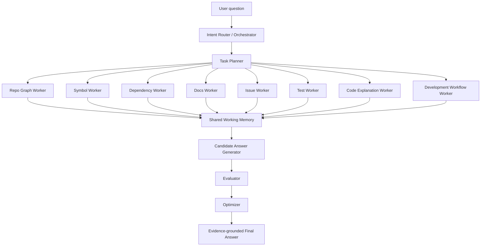

# RepoMentor Architecture

RepoMentor follows a single orchestrator plus multiple specialized workers.

Repository facts must come from deterministic parsers, GitHub API responses, file content, CI/config files, or retrieval evidence. LLM-like generation is isolated behind `llm_service.py` and is mocked in the MVP.

## Code Mapping

- `backend/app/core/orchestrator.py`: routes tasks, runs workers, builds memory and final answers.
- `backend/app/workers/*`: independent worker classes.
- `backend/app/workers/development_workflow_worker.py`: extracts contribution workflow, quality commands, PR templates and CI rules.
- `backend/app/data_layer/repository_intelligence_graph.py`: structured repository fact layer.
- `backend/app/data_layer/hybrid_retrieval_index.py`: keyword + vector fallback + metadata retrieval.
- `backend/app/answer/*`: candidate generation, evaluation, optimization, evidence formatting.
- `frontend/src/components/DevelopmentWorkflowPanel.jsx`: workflow and code-style panel for new contributors.
